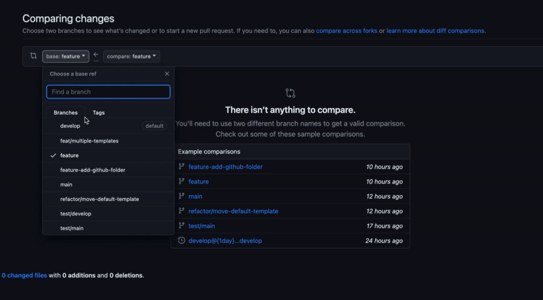

# Github Templates

Repositório de demonstração para uso de múltiplos Pull Request Templates.

## Templates Disponíveis no repositório

- default
- develop
- main

## Contexto

O _Pull Request Template_ costuma ser usado para manter um padrão de descrição em _pull requests_ para um determinado repositório. Sendo assim, são modelos (templates) de descrição que será adicionado automaticamente a descrição de um novo _Pull Request_.

Para mais informações, consulte: https://docs.github.com/en/communities/using-templates-to-encourage-useful-issues-and-pull-requests

## Como utilizar
Para configurar um template para um repositório, basta adicionar uma pasta `.github` com um arquivo `pull_request_template.md` com o conteúdo desejado. Em seguida, faça um _commit_ das alterações, e abra um _pull request_ para a branch padrão. Uma vez que o template esteja no repositório, todos os _pull requests_ seguintes terão por padrão a descrição com o template definido.

Para um tutorial completo e detalhado de como criar um template, acesse: https://docs.github.com/en/communities/using-templates-to-encourage-useful-issues-and-pull-requests/creating-a-pull-request-template-for-your-repository

Porém em alguns casos, ter um único template pode não ser conveniente...

Por exemplo, ao criar um _pull request_ da branch `feature` para a branch `develop`, pode ser útil ter um template que detalhe todas as alterações planejadas que serão "mergeadas" na branch de destino. Contudo, a medida que a branch `develop` é incrementada, ao criar um _pull request_ para a branch `main`, pode não ser prático listar minuciosamente todas as alterações. Nesse caso, é mais apropriado ter um resumo conciso, um "log" das principais mudanças que o pull request adicionará à branch.

O GitHub disponibiliza a possibilidade de ter múltiplos templates de Pull Request em um repositório, sendo possível controlar o template utilizado através de `query parameters` na URL.

[Veja na documentação oficial](https://docs.github.com/en/pull-requests/collaborating-with-pull-requests/proposing-changes-to-your-work-with-pull-requests/using-query-parameters-to-create-a-pull-request)

> `https://github.com/octo-org/octo-repo/compare/main...my-branch?template=issue_template.md` creates a pull request with a template in the pull request body. The template query parameter works with templates stored in a PULL_REQUEST_TEMPLATE subdirectory within the root, docs/ or .github/ directory in a repository.

A estrutura presente neste repositório aplica a [solução proposta nessa thread](https://stackoverflow.com/a/75030350) que visa facilitar a troca entre os templates disponíveis, criando uma "interface" interativa para o usuário.

## Como utilizar
O diretório .github tem a seguinte estrutura:

.github
├── PULL_REQUEST_TEMPLATE
│   ├── develop_pr_template.md
│   └── main_pr_template.md
└── pull_request_template.md 

1. Arquivo `pull_request_template.md`
  O template padrão, que deve dispôr os links para os templates secundários. É preciso que o usuário clique na tab "Preview" na interface do GitHub para visualizar os links clicáveis. Os links adicionam a URL atual o parâmetro "template" com o template "selecionado", modificando então a descrição atual do _pull request_ em andamento.

2. Diretório `PULL_REQUEST_TEMPLATE`
  Para termos mais de um template disponível no repositório, precisamos colocá-los todos nessa pasta. Para esse caso, manteremos na pasta apenas os templates secundários, que podem ter qualquer nome, desde que tenham o formato `.md`.

Para utilizar a atual estrutura em qualquer repositório, basta copiar o conteúdo do diretório `.github` e fazer as adaptações desejadas nos templates.

Para inspiração, alguns templates disponíveis: https://github.com/axolo-co/developer-resources/tree/main/pull-request-templates